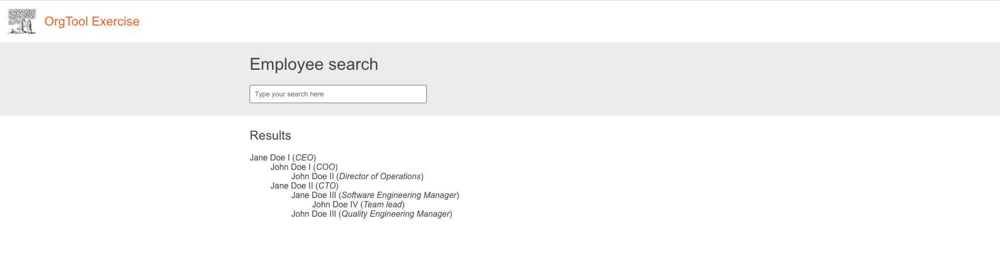
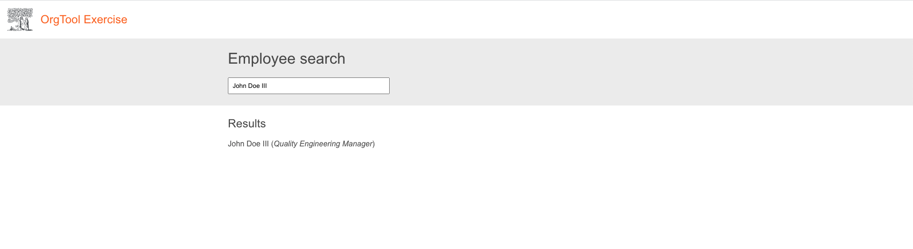
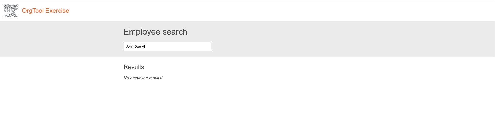

# OrgTool exercise

This exercise project is built with [Create React App](https://github.com/facebook/create-react-app), and [json-server](https://github.com/typicode/json-server).

## Instructions to run

_First time:_ `yarn install` to download needed dependencies

`yarn start` to run the CRA server

`yarn api:run` to run the API mockup

## Exercise

- Implement the user interface as close as possible to the screenshots below:

  1. Basic UI with 3 sections. Header, search bar and results.
  The list of employees must be retrieved from the [API mockup](http://localhost:4000/employees).
  
  
  2. Implement a basic case-insensitive filter for employees in any point of the hypothetical organization hierarchy. E.g.: `on doe ii` must match `John Doe II` and `John Doe III`.
  
  
  3. Display message stating that no match could be found.
  

  _Note: The orange color found on the prototype is `#f36d21`. The gray color is `#eee`_
- Technical requirement: Each employee list item should be a recursive `<Employee />` React component.
- Configure/implement/run/analyze _anything_ else you consider important! Please write down your notes from this item under the `Notes` section below, if any.
- Please document your assumptions about the API, information architecture, or the project itself, if any.
- Feel free to configure any tooling you deem important. Please update the `Instructions to run` section above in case anything gets added/changed.
- The exercise will be analyzed holistically. That means that not only the functionality, but non-functional requirements will also be assessed.
- After completing the exercise, please remove the `node_modules` directory, compress the project and submit the compressed file back.

## Notes
- ...